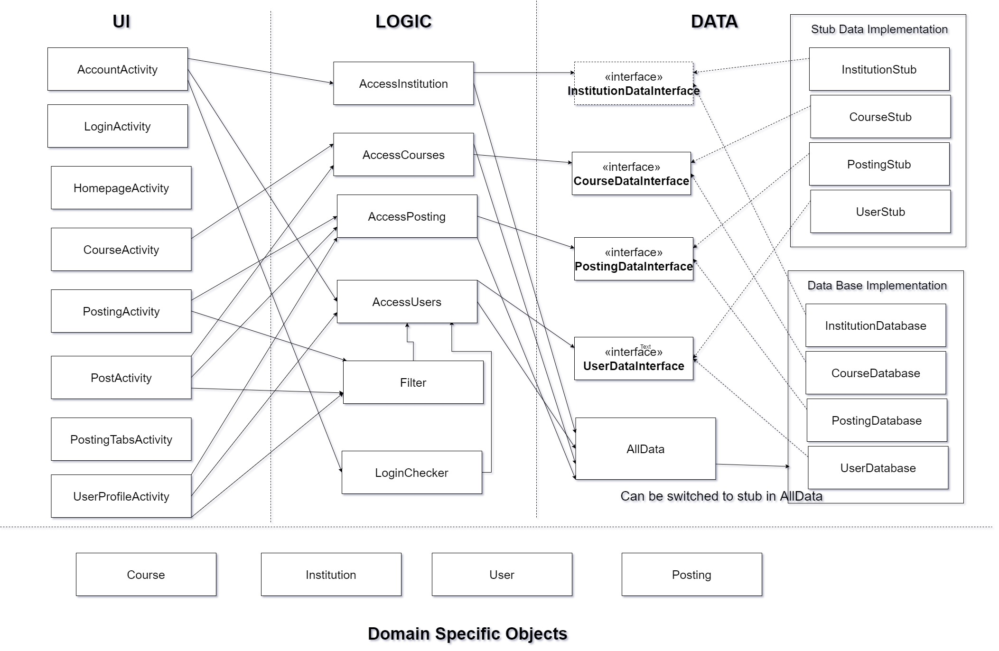

# UTTA Architecture

 UTTA is developed using a 3 tier Architecture, consisting of UI, Logic, and Data layers as well as Domain-Specific Objects

**UI**
The UI layer contains everything that will actually be presented to the user. This is where the book advertisements are actually displayed, either as a list of available postings labelled by their corresponding book titles (HomeActivity) or as a page that displays the information for a specific posting (ViewingActivity).

**Logic**
The logic layer contains all the calculations the app does. Anything the user tries to do on the UI is run through the logic layer for anything to actually happen.  This includes taking a list of postings from the data layer and delivering it to the UI layer for display (AccessPostings), logic for username/password verification (LoginChecker) and a Filter package used to filter postings by course or subject and sort the results by price.

**Data**
The data layer will one day connect to our database. It will retrieve anything we need to store on our servers, such as listings, usernames & passwords, courses, and institutions. For the time being, the data layer has a handful of pre-made entries to use. 

**Object**
The domain specific objects include the User, Institution, Posting, and Course classes. They're used throughout the application and contain variables required for all three layers. 
 
  
 
