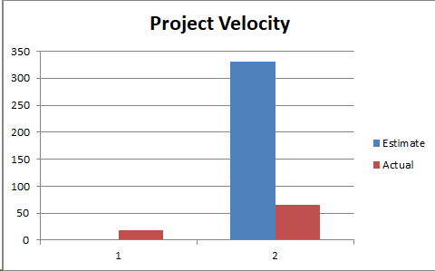

**Retrospective**

The following is a retrospective based on iteration 2 of UTTA application development. This  document will highlight parts of the project that were not up to our standards and how we can improve to be successful in iteration 3. 

The easiest thing to point to as having not been as successful as we would have liked is the database. We left any actual testing of the database until the last possible minute, instead using the fake database (a handful of object arrays) for everything. For whatever reason, we assumed that this brand-new feature that none of us had any experience with would go perfectly the first time we ran it. This was clearly a mistake in hindsight and should have been tested far earlier. The clear method of improvement for the database is to actually use it throughout the iteration to make sure it actually works. Manual testing of the app using the real database instead of a test double will ensure that the database is up to standard and functioning as intended. Our measure of success is fairly straightforward as a direct result of the simplicity of the issue itself. If the database works as intended, being constructed with a handful of pre-built log-in profiles and allowing us to add and delete entries from the posting database, it will be considered a success. If it does not do these things, whether the app can’t connect to it, or we can’t add or delete postings, it will not be considered a success. 

The team can also improve our git organization. We unsuccessfully tried to implement git flow. We were not updating the master often enough, and instead only pushed to the developer. Our branches were very different from the root at the end and when we attempted to merge branches we were faced with a lot of conflicts and disorganization. As a result the working application was lost in the different branches. This made finding bugs and errors difficult and led up to a messy repository. The mistakes are clear to everyone. We want to start off iteration 3 by cleaning up our repository and removing any unnecessary files(we had a lot of random log files). We are essentially claiming git “bankruptcy” and reverting the master to the functioning version that we would like to start iteration 3 from. The team has decided to improve by properly implementing our branch organization. By pushing to a personal/feature branch often, and then merging with the developer when a component is ready to be tested and then merging the developer with master when it is ready.As as team we need to ensure that the branches are up to date and that the developer and master have stable version of the application. Success will be evaluated according to whether the above criteria are met.

The following is a chart that shows the project velocity of the last two iterations. This may be slightly inaccurate as time was not properly tracked in the previous iterations. 

 
